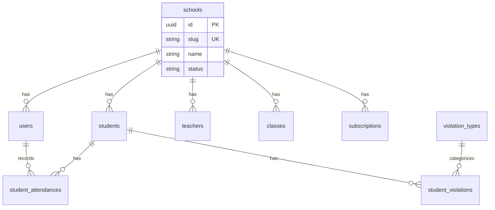

# ERD & Database — Platform Sekolah (Multi-Tenant)

> **Goal:** Skema database shared dengan isolasi `school_id`, tabel platform, dan aturan unique yang aman untuk SaaS.

**DB:** MySQL 8.x (produksi) — ⚠️ test suite jalan di SQLite `:memory:`, lihat catatan §10  
**PK domain:** UUID string (kecuali `users` — lihat §3.3)  
**Pilot schema referensi:** `project-cahaya-sunnah/database/migrations`

---

## 1. Konvensi

- Tabel domain: `uuid` PK, `timestamps`, soft delete hanya di master yang perlu history.
- Enum: VARCHAR + PHP enum class (bukan MySQL ENUM).
- Path file di DB: relatif, mis. `schools/{school_id}/students/photos/...`
- Semua query domain tenant → filter `school_id` (Global Scope).

---

## 2. Diagram ringkas



---

## 3. Tabel platform

### 3.1 `schools` (tenant master)

| Kolom | Tipe | Constraints | Catatan |
|-------|------|-------------|---------|
| id | uuid | PK | |
| name | varchar(150) | not null | Nama tampilan sekolah |
| slug | varchar(100) | **unique** | Subdomain: `{slug}.platformsekolah.id` |
| npsn | varchar(30) | nullable | |
| email | varchar(150) | not null | Kontak / PIC registrasi |
| phone | varchar(30) | nullable | |
| address | text | nullable | |
| logo_path | varchar(255) | nullable | S3 |
| timezone | varchar(50) | default Asia/Jakarta | |
| status | varchar(20) | not null | `trial`, `active`, `suspended`, `expired` |
| onboarding_step | tinyint unsigned | default 0 | Progres wizard onboarding (GT1) |
| onboarding_completed_at | timestamp | nullable | Tanda onboarding selesai (GT1) |
| trial_ends_at | timestamp | nullable | |
| student_attendance_late_after | time | nullable | Dari pilot `school_settings` |
| student_attendance_start_time | time | nullable | |
| student_attendance_departure_time | time | nullable | |
| principal_name | varchar(100) | nullable | Kop surat |
| principal_nip | varchar(50) | nullable | |
| letterhead_footer | text | nullable | |
| created_at, updated_at | timestamp | | |

**Catatan:** Field kop surat bisa tetap di `schools` (gabung `school_settings` pilot) atau tabel `school_settings` 1:1 — pilih satu pola di P1.

### 3.2 `subscriptions`

| Kolom | Tipe | Catatan |
|-------|------|---------|
| id | uuid | PK |
| school_id | uuid | FK → schools |
| plan | varchar(50) | starter / professional / premium |
| period | varchar(20) | monthly / yearly |
| starts_at, ends_at | date | |
| status | varchar(20) | active / expired / cancelled |
| amount | decimal(12,2) | |
| payment_reference | varchar(100) | nullable |

### 3.3 `users` (akun login)

> ⚠️ **Drift terhadap implementasi (per audit 2026-06-03):** tabel `users` aktual memakai **auto-increment `id` (bigint)** dari skeleton Breeze, **bukan UUID**. Kolom `teacher_id`, `status`, dan `deleted_at` **belum ada** — migrasi hanya menambah `school_id`. Tabel di bawah adalah target desain, belum tercapai sepenuhnya.

| Kolom | Tipe | Constraints | Catatan |
|-------|------|-------------|---------|
| id | bigint (aktual) / uuid (target) | PK | Aktual: auto-increment |
| school_id | uuid | nullable FK | **null** hanya untuk `super-admin` |
| name | varchar | not null | |
| email | varchar(255) | **unique global** | Satu email satu akun di seluruh platform |
| password | varchar(255) | not null | |
| email_verified_at | timestamp | nullable | Wajib untuk aktivasi — `MustVerifyEmail` **di-enforce sejak GT1**; harus masuk `User` `#[Fillable]` agar seeder/test bisa set |
| teacher_id | uuid | nullable FK | ⚠️ belum diimplementasi |
| status | varchar(20) | default active | ⚠️ belum diimplementasi |
| remember_token | varchar(100) | nullable | |
| deleted_at | timestamp | nullable | ⚠️ belum diimplementasi |

**Tidak ada `school_user` di v1.**

### 3.4 Spatie Permission (teams)

- `config/permission.php`: `'teams' => true`, `'team_foreign_key' => 'school_id'`
- `model_has_roles.team_id` = `school_id` untuk user tenant
- Role global: definisi `admin-sekolah`, `guru-kelas`, dll.
- Role platform: `super-admin` tanpa team

---

## 4. Tabel domain — wajib `school_id`

Port dari pilot; tambahkan `school_id uuid not null` + FK ke `schools.id`:

| Tabel | Unique penting (per school) |
|-------|----------------------------|
| `teachers` | `(school_id, nip)` nullable unique |
| `academic_levels` | `(school_id, name)` |
| `classes` | `(school_id, academic_level_id, name)` |
| `students` | `(school_id, nis)`, `(school_id, nisn)` nullable |
| `academic_years` | `(school_id, name)` |
| `semesters` | `(school_id, academic_year_id, name)` |
| `violation_types` | `(school_id, …)` — **per-tenant** (✅ 2026-06-03, `BelongsToSchool`) |
| `violation_thresholds` | `(school_id, points)` unique — **per-tenant** (✅ 2026-06-03, sebelumnya global) |
| `student_attendances` | `(school_id, student_id, date)` — ✅ T1 Slice 2
| `attendance_class_submissions` | `(school_id, class_id, date)` — ✅ T1 Slice 2
| `teacher_attendances` | `(school_id, teacher_id, date)` — ✅ T1 Slice 4
| `teacher_attendance_submissions` | `(school_id, date)` — ✅ T1 Slice 4
| `student_violations` | — |
| `character_point_types` | `(school_id, …)` — **per-tenant** (✅ 2026-06-03, `BelongsToSchool`) |
| `student_character_points` | — |
| `academic_calendar_holidays` | `(school_id, date)` |
| `qr_attendance_sessions` | — ✅ T1 Slice 3 |
| `school_notifications` | — ⏳ belum dimigrasi (fitur Notifikasi belum dibangun) |
| `whatsapp_messages` | — ⏳ belum dimigrasi (fitur WhatsApp belum dibangun) |
| `guardian_student` | aktual: unique `(user_id, student_id)` — **tanpa `school_id`** (isolasi lewat model terkait); ⚠️ berbeda dari rencana awal `(school_id, user_id, student_id)` |
| `backup_logs` | — ⏳ belum dimigrasi (fitur Backup belum dibangun) |
| `activity_logs` | `school_id` nullable untuk aksi platform — ✅ dimigrasi (PL1) |

### 4.1 Tabel global (tanpa `school_id`)

- `attendance_statuses` — H/T/I/S/A master
- `permissions`, `roles` — definisi
- `schools`, `subscriptions`
- `activity_logs` — `school_id` nullable (audit platform)
- ✅ `violation_types`, `violation_thresholds`, `character_point_types` — **per-tenant sejak 2026-06-03** (sebelumnya global). Pindah ke daftar §4. Lihat §8.1.

---

## 5. Index wajib

```sql
INDEX (school_id) pada setiap tabel domain
INDEX (school_id, date) pada attendance & violations filter
INDEX (school_id, class_id) pada students, submissions
```

---

## 6. Migrasi dari pilot klien

1. Create `schools` row: name = nama sekolah client, slug = `cahaya-sunnah` (contoh).
2. Script backfill: `UPDATE ... SET school_id = :pilot_school_id`.
3. Drop/replace unique indexes global → compound.
4. Re-seed roles dengan `team_id = school_id`.
5. Migrate files ke `schools/{id}/...` di S3.

---

## 7. Test data isolation (wajib)

```php
// tests/Feature/TenantIsolation/StudentIsolationTest.php
// Sekolah A tidak bisa show/update student sekolah B meski UUID diketahui
```

---

## 8. Skema lanjut (bukan P0)

- `platform_audit_logs` — aksi super-admin
- `invoices`, `payment_webhooks` — billing
- Per-tenant DB connection — hanya jika scale &gt; 500 sekolah

---

## 8.1 Catatan audit (review 2026-06-03)

1. **SQLite vs MySQL** — test suite jalan di SQLite `:memory:`, produksi MySQL 8. SQLite memperlakukan identifier yang tak dikenal (mis. `"full_name"`) sebagai string literal, sehingga error nama kolom **lolos** di test tapi gagal di MySQL. Konkret: kode menanyakan `students.full_name` padahal kolom siswa bernama `name` → 500 di produksi. ✅ Referensi `full_name` siswa sudah diganti `name` (2026-06-03, detail: `04-development-plan.md` §0.1 C1). ⬜ Belum: satu job CI yang jalan di MySQL.
2. **Katalog per-tenant** — ✅ **DIPERBAIKI 2026-06-03.** `violation_types`, `violation_thresholds`, `character_point_types` kini punya `school_id` + trait `BelongsToSchool`; unique threshold compound `(school_id, points)`. Default di-seed per sekolah via `App\Actions\Catalog\SeedDefaultCatalogAction`. Sebelumnya global dan bisa di-CRUD admin tenant lintas sekolah.
3. **Drift skema didokumentasikan inline** di §3.3 (users) dan §4 (guardian_student).

---

## 9. Referensi

- Pilot ERD lengkap: `project-cahaya-sunnah/docs/plans/02-erd-database.md`
- PRD §11: `PRD-cahaya-sunnah-school-system.md`
